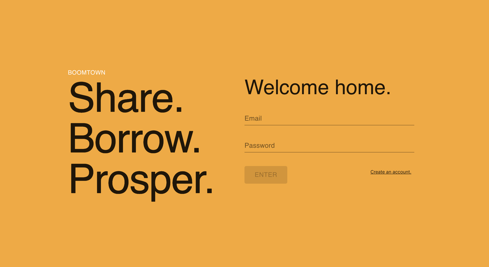
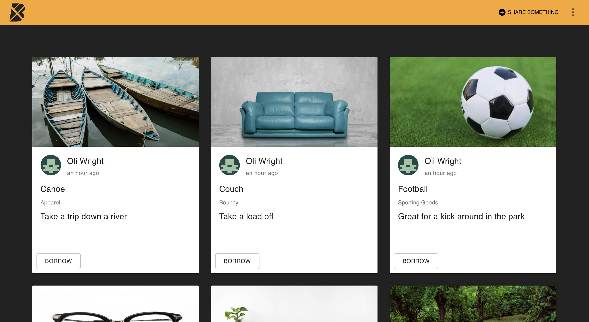
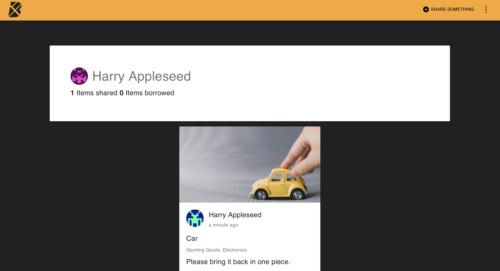

# Boomtown🏙

## Server

For this project we used Apollo, Express and Graphql to initiate an Apollo app that would allow us to query a databse using GraphQL. The aim of Boomtown is to create an app that allows sharing of items between users.

### Technologies used:

- Apollo Server
- GraphQL
- GraphQL Playground
- npm
- Node.js
- Express
- Yarn
- Posgresql
- psql command line

### Personal Learnings:

- How to create an instance of an Apollo app and how to provide it context, as well as assigning it enviroment variables.

- How to link GraphQl queries to their correct resolvers, and how to provide;
  • The SQL code needed for the functions
  • How to provide SQL with values from JS to make them dynamic

- How the GraphQL schema dictates the form and input or query must take.

- How to use the try and catch clauses to handle errors correctly, returning useful error messages without crashing the app.

- How to go about refactoring difficult code.

## Client

For the client side of this project we used React and Apollo client to create a front end whcih would allow us to display users and items from our database as well as add items, and allow users to sign up.

### Technologies used:

- Apollo Client
- GraphQL
- Redux
- yarn
- React
- React-Final Form
- React-Router
- React-Context Provider
- Json Web Tokens

### Personal Learnings:

-How to use react components to create different pages, and reuse components between them

-How to route users to different pages on our app based links, redirects and factors such as if they are logged in

-How to use final form to validate user inuputs, as well as handling submission.

-How to implement redux store to allow us to update the item preview in realtime, as the user was entering data into the form

-We used the React Context Provider component to provide data to our components on the current user (viewer) based on data we recieved from the JWT token we generated on user login/sign-up

-We convert data enter on the front end into a form that could be passed to graphQL, allowing us to query and mutate the database from the front end.

## Installation

Download or clone the repo using:

`git clone https://github.com/oliwright1994/project-01-boomtown.git`

To start the Server, change into the `root/server` directory and run:

`npm run start:dev`

To start the Client app change into the `root/client` directory and run:

`yarn start`

## Screenshots

### Welcome

### Create an Item

### Items

### Profile

## Author

Oliver Wright
[GitHub](https://github.com/oliwright1994)
